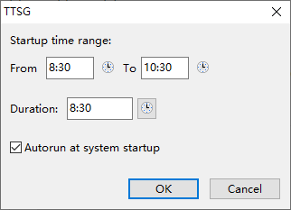

# TTSG (Time To Say Goodbye)

显示倒计时的桌面工具。

## 原理

从 Windows 事件日志中读取特定时间段内（默认是 8:30 ~ 10:30）的最早电脑开机时间作为倒计时的起始时间。如果未找到，则以程序在该时间段内的第一次启动时间为起始时间。倒计时长默认为 8 小时。

## 用法

程序启动后会在桌面右下角显示倒计时以及在系统托盘中显示图标。双击图标可以进行设置。

